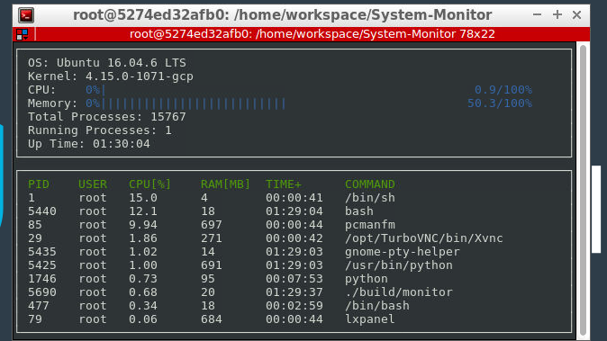

# Linux-System-Monitor

This is the System Monitor, specially designed for linux system. Major concepts used in project are related to C++ Object Oriented Programming.

Refer the following image what it looks like.

## Dependencies
### ncurses
[ncurses](https://www.gnu.org/software/ncurses/) is a library that facilitates text-based graphical output in the terminal. This project relies on ncurses for display output.

You need to install ncurses within your own Linux environment: `sudo apt install libncurses5-dev libncursesw5-dev`

## Make
This project uses [Make](https://www.gnu.org/software/make/). The Makefile has four targets:
* `build` compiles the source code and generates an executable
* `format` applies [ClangFormat](https://clang.llvm.org/docs/ClangFormat.html) to style the source code
* `debug` compiles the source code and generates an executable, including debugging symbols
* `clean` deletes the `build/` directory, including all of the build artifacts

## Instructions

1. Clone the project repository: `git clone https://github.com/vrushabhdesai/Linux_System_Monitor.git`

2. Build the project: `make build`

4. Run the resulting executable: `./build/monitor`
