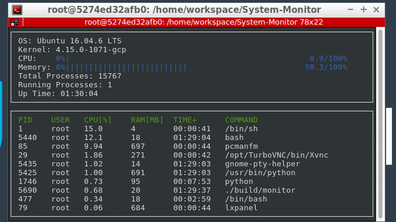

# Linux-System-Monitor

This is the System Monitor, specially designed for linux system. Major concepts used in project are related to C++ Object Oriented Programming.

Refer the following image what it looks like.


## Dependencies
### ncurses
[ncurses](https://www.gnu.org/software/ncurses/) is a library that facilitates text-based graphical output in the terminal. This project relies on ncurses for display output.

You need to install ncurses within your own Linux environment: `sudo apt install libncurses5-dev libncursesw5-dev`

## Make
This project uses [Make](https://www.gnu.org/software/make/). The Makefile has four targets:
* `build` compiles the source code and generates an executable
* `format` applies [ClangFormat](https://clang.llvm.org/docs/ClangFormat.html) to style the source code
* `debug` compiles the source code and generates an executable, including debugging symbols
* `clean` deletes the `build/` directory, including all of the build artifacts

## Project Structure

```
.
├── Makefile                # Convenience wrapper around CMake (targets: build, format, debug, clean)
├── CMakeLists.txt          # CMake build configuration
├── .clang-format           # ClangFormat style applied by `make format`
├── images/                 # Screenshot shown in this README
├── include/                # Header files (class/namespace declarations)
│   ├── system.h            # System: overall machine state — CPU, memory, processes, uptime
│   ├── process.h           # Process: a single running process and its stats
│   ├── processor.h         # Processor: aggregate CPU utilization
│   ├── linux_parser.h      # LinuxParser: reads /proc to gather raw system data
│   ├── ncurses_display.h   # NCursesDisplay: draws the monitor UI in the terminal
│   └── format.h            # Format: turns seconds into an HH:MM:SS string
└── src/                    # Implementations of the headers above, plus main.cpp (entry point)
```

## Instructions

1. Clone the project repository: `git clone https://github.com/vrushabhdesai/Linux_System_Monitor.git`

2. Build the project: `make build`

3. Run the resulting executable: `./build/monitor`
